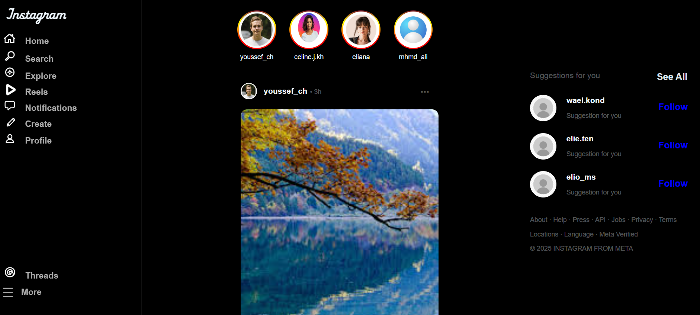

# Instagram Clone

A modern and responsive Instagram-inspired social media interface that recreates the visual experience of the Instagram web platform with a clean dark-themed design.

## Features

* Responsive layout for desktop and mobile
* Stories section
* Interactive posts interface
* Like, comment, share, and save actions
* Sidebar navigation menu
* Suggested users section
* Modern dark UI design

## Technologies Used

* HTML5
* CSS3

## Purpose

This project was built to improve my frontend development skills and practice building responsive social media interfaces inspired by modern web applications.

## Live Demo

https://mohammadchebly.github.io/InstaClone/

## Preview

## Author

Mohammad Chebly
